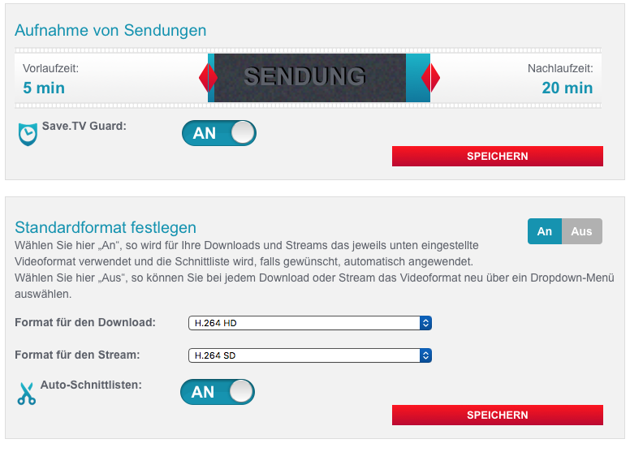
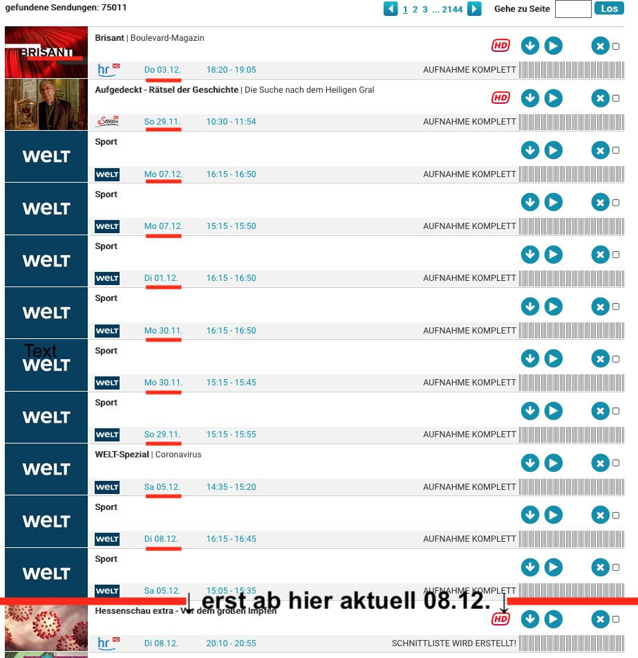

    _______ _______ _    _ _______   _______ _    _
    |______ |_____|  \  /  |______      |     \  /
    ______| |     |   \/   |______ .    |      \/  
    ===============================================
    ____ C_a_t_c_h_A_l_l___e_i_n_r_i_c_h_t_e_n ____

## Table of contents
  * [Hintergrund](#hintergrund)
  * [Funktionsweise](#funktionsweise)
  * [Einrichten und Starten](#einrichten-und-starten)
    + [Username und Passwort](#username-und-passwort)
        + [Erstes Login und manuelles Login](#erstes-login-und-manuelles-login)
        + [Automatisches Login](#automatisches-login)
        + [Wechsel zwischen den Loginoptionen](#wechsel-zwischen-den-loginoptionen)
    + [Sender von der automatischen Aufnahme ausschließen](#sender-von-der-automatischen-aufnahme-ausschlie%C3%9Fen)
    + [Angelegte Channels behalten `auto`, `immer`, `nie`](#angelegte-channels-behalten-auto-immer-nie)
    + [Aufbau der Channeltitel](#aufbau-der-channeltitel)
    + [Hinweis zum Ende des kostenlosen XXL Upgrades zum 26.05.2020](#hinweis-zum-ende-des-kostenlosen-xxl-upgrades-zum-26052020)
    + [Tip: Channels "korrigieren"](#tip-channels-korrigieren)
    + [Besonderheit beim Basis Paket](#besonderheit-beim-basis-paket)
    + [Versionsüberprüfung](#Versions%C3%BCberpr%C3%BCfung)
    + [Funktionstest](#funktionstest)
        + [Funktionstest aufrufen](#funktionstest-aufrufen)
    	+ [Beispielausgabe des Funktionstests](#beispielausgabe-des-funktionstests)
    + [Ausführungsstatus kontrollieren](#ausf%C3%BChrungsstatus-kontrollieren)
    + [Fehlerausgabe](#fehler-w%C3%A4hrend-der-skriptausf%C3%BChrung)
        + [im Direktmodus](#im-direktmodus)
    	+ [im Batchmodus](#im-batchmodus)
        + [Wiederholung der Channelanlage](#wiederholung-der-channelanlage)
    + [Servicehinweis: Save.TV Aufnahme-Optionen prüfen](#servicehinweis-savetv-aufnahme-optionen-pr%C3%BCfen)
    + [Tip für Mac-User](#tip-f%C3%BCr-mac-user)
    + [Hinweis zur Verwendung unter Termux](#hinweis-zur-verwendung-unter-termux)
    + [Beispielausgabe CatchAll Programmierung](#beispielausgabe-catchall-programmierung)
  * [Bereinigungsfunktionen](#bereinigungsfunktionen)
    + [Modul Reste aufräumen](#modul-reste-aufr%C3%A4umen)
      + [Reste aufräumen Hintergrund](#reste-aufr%C3%A4umen-hintergrund)
      + [Reste aufräumen Funktionsweise](#reste-aufr%C3%A4umen-funktionsweise)
      + [Reste aufräumen einmalig starten](#reste-aufr%C3%A4umen-einmalig-starten)
      + [Reste aufräumen starten und anschließend Catchall Channel anlegen](#reste-aufr%C3%A4umen-starten-und-anschlie%C3%9Fend-catchall-channel-anlegen)
      + [Beispielausgabe der Moduls Reste aufräumen](#beispielausgabe-des-moduls-reste-aufr%C3%A4umen)
    + [Modul Channels aufräumen](#modul-channels-aufr%C3%A4umen)
      + [Channels aufräumen Hintergrund](#channels-aufr%C3%A4umen-hintergrund)
      + [Channels aufräumen Funktionsweise und Aufruf](#channels-aufr%C3%A4umen-funktionsweise-und-aufruf)
      + [Beispielausgabe des Moduls Channels aufräumen](#beispielausgabe-des-moduls-channels-aufr%C3%A4umen)
    + [Modul Zombieaufnahmen löschen](#modul-zombieaufnahmen-l%C3%B6schen)
      + [Zombieaufnahmen löschen Hintergrund](#zombieaufnahmen-l%C3%B6schen-hintergrund)
      + [Zombieaufnahmen löschen Funktionsweise und Aufruf](#zombieaufnahmen-l%C3%B6schen-funktionsweise-und-aktivierung)
      + [Beispielausgabe des Moduls Zombieaufnahmen löschen](#beispielausgabe-des-moduls-zombieaufnahmen-l%C3%B6schen)
  * [Installation auf einem Raspberry Pi mit täglicher Ausführung](#installation-auf-einem-raspberry-pi-mit-t%C3%A4glicher-ausf%C3%BChrung)
    + [Einmaliger Download](#einmaliger-download)
    + [Per Git installieren](#per-git-installieren)
    + [Dateirechte setzen](#dateirechte-setzen)
    + [Tägliche Ausführung einrichten](#t%C3%A4gliche-ausf%C3%BChrung-einrichten)
  * [Hilfefunktion](#hilfefunktion)
 
## Hintergrund
[SaveTV](https://www.save.tv/) bietet keine CatchAll Funktion bei der automatisch alle Sendungen aller verfügbaren Sender aufgenommen werden.

Zur Aufnahmeprogrammierung können [je nach gebuchtem Paket](https://www.save.tv/stv/s/misc/paketauswahl.cfm) eine unterschiedliche Anzahl an Channels (5 Basis, 20 XL, 200 XXL) verwendet werden.

Über die [Erweiterten Einstellungen](https://www.save.tv/STV/M/obj/channels/ChannelAnlegen.cfm) kann ein Channel für einen Sender und einen Zeitslot (0-6 Uhr, 6-12 Uhr, 12-18 Uhr, 18-24 Uhr) programmiert werden.

Während sich mit den 200 Channels des XXL-Pakets die Catchall Funktion durch Programmierung von vier Zeitslots für die 46 SaveTV Sender (4 x 46 = 184 Channels) mit etwas Anlegefleiß nachbilden läßt, bieten das Basis-Paket mit 5 Channels und des XL Paket mit 20 Channels nicht genug Channels um alle Slots für alle Sender zu programmieren.

Die Grundidee von SaveTV Catchall basiert auf den unterschiedlichen Optionen, die beim Channellöschen angeboten werden 

Da bei der ersten Option die Programmierungen erhalten bleiben, kann man nach der Anlage der Programmierung den Channel wieder löschen und einen anderen Zeitslot / Sender mit dem gleichen Channel programmieren.

## Funktionsweise
STV CatchAll benötigt vier Channels (für die vier Zeitslots eines Senders) um darüber für alle Sender eine Programmierung anzulegen.

Eventuell im Account bereits enthaltene manuell vorgenommene Channelprogrammierungen bleiben erhalten. Sollten weniger als vier freie Channels vorhanden sein, wird das Skript mit einem entsprechenden Hinweis abgebrochen.

Direkt nach Anlage der vier Zeitslotchannels eines Senders werden diese wieder gelöscht, wobei die Programmierungen erhalten bleiben (s.o.). Dadurch können die gleichen Channels für den nächsten Sender wiederverwendet werden.

Je Sender erfolgen 9 save.tv Zugriffe, wodurch das Skript relativ langsam läuft
* 4 x Senderzeitslotchannel anlegen (0-6 Uhr, 6-12 Uhr, 12-18 Uhr, 18-24 Uhr)
* 1 x Aufruf Channelübersicht, um die ChannelIDs der angelegten Channels abzufragen
* 4 x Senderzeitslotchannel löschen

Der Nachteil dieses Verfahren besteht allerdings darin, daß die Programmierung der Aufnahmen nur ca. sieben Tage in die Zukunft reicht, so daß das Skript regelmäßig ausgeführt werden muß, um die neu hinzugekommenen Sendungen und eventuelle Programmänderungen zu programmieren.
SaveTV aktualisiert sein Angebot einmal täglich gegen 4:30 Uhr, so daß das Skript kurz danach laufen sollte, um alle Änderungen zeitnah zu berücksichtigen.

Siehe auch [Installation auf einem Raspberry Pi mit täglicher Ausführung](#installation-auf-einem-raspberry-pi-mit-t%C3%A4glicher-ausf%C3%BChrung)

Auf einem Raspberry Pi Zero W benötigt das Skript je nach der aktuellen Auslastung des SaveTV Servers etwa 18 Sekunden für die vier Channels eines Senders, bei mir um die 10 bis 11 Minuten für 36 aufzunehmende Sender. 
	
## Einrichten und Starten
### Username und Passwort
#### Erstes Login und manuelles Login 
Die Accountdaten, der Save.TV Username und das Passwort, werden beim Skriptstart abgefragt und auf Wunsch für eine automatische Skriptausführung gespeichert.

    ./stvcatchall.sh
    [i] Keine gespeicherten Logindaten vorhanden, bitte manuell eingeben
        Save.TV Username: 612612
        Save.TV Passwort: R2D2C3PO
    [✓] Login bei SaveTV als User 612612 war erfolgreich!
Nach der Eingabe von Username und Passwort loggt sich das Skript mit diesen Daten bei Save.TV ein, sind die eingegeben Daten nicht korrekt, kann die Eingabe direkt wiederholt werden.

    [-] Login mit diesen Userdaten nicht möglich
        Username und Passwort prüfen und Eingabe wiederholen
    [i] Keine gespeicherten Logindaten vorhanden, bitte manuell eingeben
        Save.TV Username: 
Nur wenn die Daten korrekt sind, wird ein Abspeichern für das automatische Login angeboten.

        Die Zugangsdaten können zum automatischen Login gespeichert werden
	    Zugangsdaten speichern? (J/N)? :
	
#### Option 'J' Speicherung in Datei 
    [i] Zugangsdaten wurden in 'stv_autologin' gespeichert
	

### Automatisches Login
Ist die Datei `stv_autologin` vorhanden erfolgt das Login automatisch.

    ./stvcatchall.sh
    [✓] Login bei SaveTV als User 612612 war erfolgreich!

    
### Wechsel zwischen den Loginoptionen
Das Skript erkennt die zuverwendene Loginoption Datei/manuell anhand des Vorhandenseins der Datei `stv_autologin`. Für den Wechsel zum manuellen Login diese Dateien im Skriptverzeichnis löschen, beim nächsten Skriptstart erscheint dann der initiale Auswahldialog (siehe [Erstes Login und manuelles Login](#erstes-login-und-manuelles-login)). Am besten startet man hierfür das Skript mit der Funktionstestoption `-t`.

#### Login Fehler
Sind die gespeicherten Daten nicht mehr korrekt, wird eine entsprechende Fehlermeldung ausgegeben bzw. um die Eingabe neuer Daten gebeten.

    [-] Fehler beim Login mit UserID 612612!
        Bitte in 'stv_autologin' Username und Passwort prüfen
    
        Aktueller Inhalt von stv_autologin:
        612612 FalschesPasswort	
		    
Bei einem Überlast 500er Serverfehler beim Login, wird das Skript direkt beendet.

### Sender von der automatischen Aufnahme ausschließen
Standardmäßig wird die Aufnahme **aller** Sendungen **aller** Sender programmiert. 
Das Skript holt beim Start eine aktuelle Senderliste vom SaveTV Server und speichert diese als `stv_sender.txt` ab. Eventuell neu hinzugekommene Sender werden automatisch zur Aufnahme programmiert.

Durch die Datei `stv_skip.txt` können einzelne Sender von der Aufnahme ausgeschlossen werden. Wird diese Datei gelöscht, legt das Skript beim Start automatisch eine neue leere Datei an.

`stv_sender.txt` und `stv_skip.txt` verwenden das gleiche Format ("SenderID|Sendername" "10|KiKA").

Damit man seine persönliche Skipliste einfach erstellen kann, wird die aktuelle Senderliste als Muster unter `stv_skip_vorlage.txt` angelegt. Dort kann man mit einem Texteditor diejenigen Sender/Zeilen entfernen, die weiterhin aufgenommen werden sollen, sodaß **nur die nicht aufzunehmenden Sender** übrigleiben.

Wenn man fertig ist, speichert man diese geänderte Datei unter dem Namen `stv_skip.txt` ab.

	> cat stv_skip.txt
	92|Disney Channel
	60|DMAX
	7|Eurosport
	96|Fix und Foxi
	59|Folx TV
	40|Health TV
	10|KiKA
	11|MTV
	93|RiC
	6|SPORT 1
	95|TLC

Zusätzlich kann man durch manuellen Aufruf des Funktionstests `./stvcatchall.sh -t` ([mehr …](#funktionstest)) die Korrektheit der Skipliste kontrollieren.

    [i] Aktuell sind 46 Sender bei Save.TV verfügbar.    
    [i] Die Liste der ausgeschlossenen Sender 'stv_skip.txt' beinhaltet:
        KiKA                  MTV                   Health TV          
        Folx TV               SPORT 1               DMAX               
        Eurosport             Disney Channel        RiC                
        TLC                   Fix und Foxi  

### Angelegte Channels behalten `auto`, `immer`, `nie`
Durch den Parameter `anlege_modus` wird gesteuert, wie mit den durch das Skript angelegten Channels verfahren wird. Normalerweise wird man die voreingestellte Option `auto` verwenden, kann sie aber auch überschreiben.

***Defaulteinstellung `anlege_modus=auto`***  
Bei dem **Basis** und **XL** Paket werden die Channels nach dem Anlegen **wieder gelöscht**,  
beim **XXL** Paket bleiben die Channels **erhalten**.  
Sollten beim Start nicht genügend ungenutzte Channels vorhanden sein, wird geprüft, ob die neu anzulegenden Channels bereits vorhanden sind und ein entsprechender Hinweis im Infochannel "_ OK nur Dups" ausgegeben, anderenfalls bricht das Skript mit einem Hinweistext ab.

***`anlege_modus=immer`***  
Vom Skript angelegte Channels bleiben immer erhalten. Das Skript prüft vor dem Start, ob noch genügend ungenutzte Channels vorhanden sind und wechselt bei Bedarf zurück in den `auto` Modus. Ein Hinweistext wird ausgeben.

***`anlege_modus=nie`***  
Vom Skript angelegte Channels werden nach dem Anlegen wieder gelöscht, auch wenn mehr ungenutzte Channels verfügbar sind als benötigt werden. Der Pseudostichwortchannel mit dem Ausführungsstatus wird nicht angelegt.

### Aufbau der Channeltitel
Es werden zwei Arten von Channels durch das Skript angelegt, der Infochannel und die Senderchannels.
Der Infochannel zeigt Statusinformationen zum letzten Skriptlauf und wird im Webinterface und der App ganz oben angezeigt, die Senderchannels werden entweder direkt nach der Anlage wieder gelöscht oder sortieren sich am Ende der Userchannelliste ein.

Beispielhafte Channelliste mit automatisch vom Skript und vom XXL-User manuell angelegten Channels 

	_ OK nur Dups So 0524 1320
	Hamsterikebana  (z.B. manuell angelegter Stichwortchannel)
	Tatort          (z.B. manuell angelegter Serienchannel)
	(...)
	zz 3sat - Abend
	zz 3sat - Nachmittag
	(...)
	zz zdfinfo - Nacht
	zz zdfinfo - Vormittag

#### Aufbau des Infochannels

	_  OK Mi 0731 2258 Neue Version	>>> Bedeutung
	_				Underscore am Anfang = von CatchAll angelegt
	OK oder FEHLER			fehlerfrei bzw. Fehler sind aufgetreten
	OK nur Dups                     alle anzulegenden Channels waren bereits vorhanden
	Mi 0731	2258 			Datum (Wochentag Monat Tag) Uhrzeit (Stunde Minute)					
	Neue Version			(optional) eine neuere Skriptversion ist verfügbar
	
#### Aufbau der Senderchannels
Die Senderchannels werden beim XL Paket direkt nach der Anlage wieder gelöscht, beim XXL Paket soriteren sie sich ans Ende der Channelliste.

	zz 3sat - Abend                 >>> Bedeutung
	zz				zz sortiert die Catchall Channel nach hinten
	3sat				Sendername
	Abend				Timeslot (Vormittag,Nachmittag,Abend,Nacht)

#### Tip: Channels "korrigieren"
Hat man aus Versehen zu viele Channels angelegt oder möchte nur alle Channels löschen lassen, kann man die [Zusatzfunktion Reste aufräumen](#zusatzfunktion-reste-aufr%C3%A4umen) verwenden.

### Hinweis zum Ende des kostenlosen XXL Upgrades zum 26.05.2020
Die zusätzlichen XXL Channels sind auch nach dem 26.05.2020 noch aktiv, wenn sie **vor** dem 17. Juni 2020 angelegt wurden. Die Channels lassen sich löschen, aber nicht wieder neu anlegen.

Die Empfehlung hierzu ist ausgelagert: [siehe Issue #3](https://github.com/einstweilen/stv-catchall/issues/3)

### Besonderheit beim Basis Paket
STV Catchall kann zwar mit dem Basis Paket verwendet werden, aber das Einrichten von CatchAll Channels ist nicht sinnvoll, da das Basis Paket nur einen begrenzten Aufnahmespeicher von 50 Stunden bietet.

### Versionsüberprüfung
Die automatische Prüfung bei jedem Skriptlauf kann durch Ändern des Flags `check_version` von defaultmäßig `true` auf `false` deaktiviert werden. Beim Funktionstest `-t` bzw.  `--test` wird immer auf eine neuere Skriptversion hin geprüft.

Bei der Versionsüberprüfung werden keine Daten an den Server gesendet, es wird die Datei `stv-version-check` von GitHub geladen und mit der lokalen Skriptversion verglichen.
Wird eine neuere Version gefunden, wird "Neue Version" an die Ausführungsinformation des Skripts angehängt - siehe '[Ausführungsstatus kontrollieren](#ausf%C3%BChrungsstatus-kontrollieren)'.

### Funktionstest
Der Funktionstest überprüft neben den Skripteinstellungen den korrekten Zugriff auf den SaveTV Account. Die für die Sendungsprogrammierung relevanten Daten werden angezeigt, um besonders beim ersten Start, keine "falschen" Programmierungen anzulegen.

Werden beim Test langsame Antwortzeiten oder Timeouts festgestellt, wird die Anzahl der Störungungsmeldungen auf AlleStörungen.de der letzten 24 Stunden und der letzten Stunde ausgegeben.

#### Funktionstest aufrufen
Bei der ersten Skriptausführung wird der Funktionstest `Soll ein Funktionstest durchgeführt werden (J/N)? :` automatisch angeboten. 

Zusätzlich zum automatischen Aufruf beim ersten Skriptstart kann der Funktionstest mit den Optionen `-t` `--test` direkt aufgerufen werden.

Hinweis: der erste Aufruf des Skripts wird anhand des Fehlens der Logdatei `stv_ca.log` erkannt.

#### Beispielausgabe des Funktionstests
    Funktionstest auf korrekte Logindaten und verfügbare Channels wird durchgeführt.
    
    [-] Automatische Versionsüberprüfung ist AUS
    [✓] Skript ist aktuell
    [✓] Schreibrechte im Skriptverzeichnis
    
    [✓] gespeicherte Logindaten in 'stv_autologin' vorhanden
    [✓] Login mit UserID 612612 erfolgreich
    [i] Paket 'Save.TV XL 24 Monate', Laufzeit bis zum 2020-12-31
        20 Channels enthalten, davon aktuell 10 benutzt
        Channelanlegemodus 'auto' wird verwendet
        Sendungen aufgenommen 136674, Sendungen programmiert 9662

    [i] Eingestelle Pufferzeiten und Aufnahmeoptionen
        Vorlaufzeit: 5 Min.   Nachlaufzeit: 20 Min. Auto-Schnittlisten: AN
    
    [i] Aktuell sind 46 Sender bei Save.TV verfügbar.    
    [i] Die Liste der nicht aufzunehmenden Sender 'stv_skip.txt' beinhaltet:
        KiKA                  MTV                   Health TV          
        Folx TV               SPORT 1               DMAX               
        Eurosport             Disney Channel        RiC                
        TLC                   Fix und Foxi                          
                                                                   
    [✓] Testchannel erfolgreich angelegt
    [✓] Channelliste einlesen
    [✓] Testchannel erfolgreich gelöscht
    
    [✓] Logout durchgeführt
  
    [i] Prüfe auf von Usern gemeldete Störungen
        Auf AlleStörungen.de wurden in den letzten 24 Std. 74 Störungen gemeldet,
        letzte Meldung um 2020-01-07 15:46:38. Letzte Stunde gab es keine Störungen.
        Stand: 2020-01-07 18:46:38 <https://AlleStörungen.de/stoerung/save-tv/>
	
    [i] Funktionstest wurde in 9 Sekunden abgeschlossen

#### Beispielausgabe des Funktionstests mit Loginfehler
    [-] Neue Skriptversion '2020-01-07' ist verfügbar, Update wird empfohlen
    [✓] Schreibrechte im Skriptverzeichnis
    
    [-] Fehler beim Login mit UserID 612612!
        Bitte in 'stv_autologin' Username und Passwort prüfen
    
        Aktueller Inhalt von stv_autologin:
        612612 FalschesPasswort

        Sind die Userdaten korrekt, kann auch eine allgemeine Störung vorliegen.
        In der letzten Stunde wurden 60 Störungen auf AlleStörungen.de
        gemeldet. <https://AlleStörungen.de/stoerung/save-tv/>

#### Beispielausgabe bei noch vorhandenen XXL Channels im XL Paket
    [!] Es sind mehr Channels angelegt, als im gebuchten Paket verfügbar sind!
        Diese können z.B. beim temporären XXL Upgrade 05/2020 angelegt worden sein,
        sie sollten nur bei dringendem Bedarf gelöscht werden, da eine Neuanlage
        nur im Rahmen des gebuchten Pakets möglich ist.

#### Beispielausgabe bei langer Laufzeit des Funktionstests
    [-] Der Funktionstest hat länger als die erwarteten 10 Sekunden benötigt!
        Auf AlleStörungen.de wurden in den letzten 24 Std. 74 Störungen gemeldet,
        letzte Meldung um 2020-01-07 15:46:38. Letzte Stunde gab es keine Störungen.
        Stand: 2020-01-07 18:46:38 <https://AlleStörungen.de/stoerung/save-tv/>

### Ausführungsstatus kontrollieren
Der aktuelle Skriptfortschritt wird während der Ausführung auf dem Bildschirm (siehe unten "Beispielausgabe") ausgegeben, zusätzlich wird zur späteren genaueren Kontrolle im Skriptverzeichnis eine Logdatei geschrieben die sämtliche vom Skript angelegte Channels und eventuelle Fehlermeldungen enthält.

Die Logdatei hat das Format stv_ca_TAG_UHRZEIT.log z.B. `stv_ca_1229_0517.log`. Die aktuellste Logdatei ist immer unter dem Link `stv_ca.log` abrufbar. Es werden die Logs der letzten sieben (sechs alte Logs plus dem aktuellen) Skriptausführungen aufgehoben, längere oder kürzere Fristen lassen sich im Skript per `log_max` einstellen. 

Der Status des letzten Skriptlaufs läßt sich von jedem Gerät aus prüfen ohne im Log nachsehen, z.B. direkt auf der SaveTV Webseite oder der SaveTV App, dazu wird am Ende der Skriptausführung eine Kurzzusammenfassung als "Pseudostichwortchannel", dessen Titel den Status und das Datum der Ausführung enthält, angelegt.

Optional: Ist die [Versionsüberprüfung](#Versions%C3%BCberpr%C3%BCfung) aktiviert und sollte eine neue Skriptversion verfügbar sein, wird zusätzlich "Neue Version" angezeigt.

Der Channeltitel hat dabei folgenden Aufbau:

	_  OK Mi 0731 2258 Neue Version	bedeutet
	_				Underscore am Anfang = von CatchAll angelegt
	OK / FEHLER			fehlerfrei bzw. Fehler sind aufgetreten
	Mi 0731				Datum Wochentag Monat Tag
	2258				Uhrzeit Stunde Minute
	Neue Version			(optional) eine neuere Skriptversion ist verfügbar
	
Für diese Statusinformation wird kein Channel "verschwendet", da dieser Channel bei der nächsten Skriptausführung als erstes gelöscht wird, bevor weitere Channels angelegt werden. Und da der "Pseudochannel" erst ganz am Ende neu angelegt wird, nachdem alle zur Skriptausführung benötigten temporären Channels bereits wieder gelöscht wurden, belegt er quasi nur den Platz eines der temporären Channels während das Skript nicht läuft.

### Fehler während der Skriptausführung
#### im Direktmodus
Sollten bei der Channelanlage Fehler auftreten, so wird im Fortschrittsbalken statt des "✓" für Okay ein "F" ausgegeben und am Ende zeigt das Skript die Logdatei an.

Wird die Anzahl der maximal erlaubten Fehler überschritten, defaultmäßig `err_max=9`, bricht das Skript vorzeitig ab. Auf AlleStörungen.de wird geprüft, ob auch andere User aktuell Probleme melden:

    Es sind 6 Fehler aufgetreten, das Skript wird beendet.
    AlleStörungen.de meldet in der letzten Stunde 14 Störungen 

Meistens treten Fehler auf, wenn die SaveTV Server im Moment der Channelanlage überlastet sind. Bei einem späteren Anlegeversuch werden diese Channels ohne Fehler eingerichtet. Daher können Fehler i.d.R. ignoriert werden, solange das Skript zeitnah, maximal jedoch innerhalb von 7 Tagen erneut gestartet wird und fehlerfrei durchläuft. Zusätzlich werden am Ende der Skriptsusführung einstellbar häufige Versuche der erneuten Channelanlage durchgeführt ([mehr ](#wiederholung-der-channelanlage)).

Die konkrete Serverfehlermeldung ist in der Logdatei `stv_ca_TAG_UHRZEIT.log` enthalten.
Schwerwiegende Fehler sind zum leichteren Filtern mit einem `:` am Zeilenanfang markiert.

    : *** Fehler *** bei 2 arte Nachmittag
    : Grund : 500 - Internal server error.
    : *** Fehler *** bei 2 arte Abend
    : Grund : 504 - www.save.tv | 504: Gateway time-out
    : *** Fehler *** bei 2 arte Nacht
    : Grund: Channel mit gleichem Zeitraum ist bereits vorhanden!
    : Tip  : Channelliste mit -c prüfen und bereinigen
    : Es sind 6 Fehler aufgetreten, das Skript wird vorzeitig beendet.
    : AlleStörungen.de meldet in der letzten Stunde keine Störungen
    
Sollten durch die Servernichterreichbarkeit oder den Skriptabbruch nicht gelöschte temporäre Channel zurückbleiben, können diese mit der [Funktion Channels aufräumen](#zusatzfunktion-channels-aufr%C3%A4umen) gelöscht werden.
#### im Batchmodus
Durch Auswertung des EXITcodes nach der Skriptausführung kann über die Ausgabe eventueller Anlagefehler im Statuschannel hinaus ([mehr …](#ausf%C3%BChrungsstatus-kontrollieren)) auch auf eventuell aufgetretene schwere Fehler, die zu einem Skriptabbruch geführt haben, reagiert werden.

`Exitcode 0` zeigt eine erfolgreiche Skriptausführung, alle Channels konnten angelegt werden

`Exitcode 1` wird für schwerwiegende Fehler wie Loginfehler oder gehäufte Fehler bei der Channelanlage verwendet, die zu einem vorzeitigen Skriptabbruch führen und bei denen deshalb vom Skript kein neuer Statuschannel angelegt werden konnte.
Eine fehlerhafte Ausführung ist dann nur am veralteten Datum des Statuschannels oder dem gänzlichen Fehlen des Statuschannels erkennbar.

`Exitcode 2` zeigt an, daß bei der Channelanlage Fehler aufgetreten sind, die sich aber unterhalb der festgelegten Grenze, defaultmäßig `err_max=9`, bewegten

#### Wiederholung der Channelanlage
Die häufigsten Fehler treten durch eine momentane Überlastung des Webservers auf.

Die bei der Channelanlage aufgetretenen Fehler werden gezählt und wenn die Gesamtfehlerzahl beim Channelanlegen unter dem Maximalwert von 9 Fehlern bleibt (konfigurierbar durch `err_max`) werden im Anschluß bis zu 3 (konfigurierbar durch `vers_max`) weitere Versuche unternommen, die Channels anzulegen. Dabei wird zwischen den einzelnen Durchläufen jeweils eine Pause von 10 Minuten (konfigurierbar durch `vers_sleep`) eingelegt.

Wird `vers_max=0` gesetzt, wird keine Wiederholung der Channelanlage durchgeführt.

In Serverhochlastzeiten sollte `err_max` auf einen höheren Wert gesetzt werden, sonst bricht das Skript beim Erreichen des Maximalwerts ab, bevor der erste Durchlauf abgeschlossen wurde. Dann wird auch kein neuer Anlegeversuch durchgeführt.

    Anlage der fehlerhaften Channels wird erneut versucht
    Versuch 1 von 3, noch 3 Channels anzulegen
    ✓ Erfolgreich angelegt: 3sat Nachmittag
    - Fehler bei          : NDR Vormittag
    - Fehler bei          : zdf Abend
    Warte 600 Sekunden bis zum nächsten Durchlauf
    Versuch 2 von 3, noch 2 Channels anzulegen
    ✓ Erfolgreich angelegt: NDR Vormittag
    ✓ Erfolgreich angelegt: zdf Abend
    Alle 3 Channels konnten erfolgreich angelegt werden.

### Servicehinweis: Save.TV Aufnahme-Optionen prüfen
Bitte vor dem ersten Skriptlauf prüfen, ob die Save.TV Einstellungen zu Vorlauf-, Nachlaufzeit und Auto-Schnittlisten den eigenen Wünschen entsprechen.

Link zu den Optionen bei [Save.TV > Account-Einstellungen > Aufnahme-Optionen](https://www.save.tv/STV/M/obj/user/config/AccountEinstellungen.cfm?iActiveMenu=0)

### Tip für Mac-User
Durch Ändern der Fileextension von `stvcatchall.sh` in `stvcatchall.console` kann das Skript direkt im Finder per Doppelklick gestartet werden; es wird ein neues Terminalfenster geöffnet, in dem das Skript dann abläuft.

Diese Datei kann man auch als Autostartobjekt verwenden, dann wird es bei jedem Systemstart automatisch ausgeführt.
[Externe Anleitung: Autostart-Programme über die Systemeinstellungen festlegen](https://www.heise.de/tipps-tricks/Mac-Autostart-Programme-festlegen-4025523.html#anchor_2)

### Hinweis zur Verwendung unter Termux
Das Skript kann mit [Termux unter Android](https://termux.com/) verwendet werden.  
In der Termux Standardinstallation ist `curl` noch nicht enthalten, es kann mit `pkg install curl` nachinstalliert werden.

### Beispielausgabe CatchAll Programmierung
                _______ _______ _    _ _______   _______ _    _
                |______ |_____|  \  /  |______      |     \  /
                ______| |     |   \/   |______ .    |      \/ 
                ===============================================
                ____ C_a_t_c_h_a_l_l___e_i_n_r_i_c_h_t_e_n ____
		
	Aufnahme aller Sendungen der nächsten 7 Tage für folgende 36 Sender einrichten:
	3sat                ANIXE HD            ARD alpha HD        arte               
	BR                  Comedy Central      Das Erste           DELUXE MUSIC       
	eoTV                hr                  Kabel 1             mdr                
	N24 Doku            NDR                 Nickelodeon         n-tv               
	ONE HD              phoenix             ProSieben           ProSieben MAXX     
	RBB                 RTL II              SAT.1               SAT.1 Gold         
	ServusTV            sixx                SUPER RTL           SWR                
	tagesschau24        Tele 5              VOX                 WDR                
	WELT                ZDF                 zdf_neo             zdfinfo            
                                                                               
	Es werden jeweils 4 temporäre Channels angelegt und wieder gelöscht.
    
    Channels + anlegen  - löschen  ✓ Sender programmiert  F_ehler&Anzahl
    Sender : ✓✓✓✓✓ ✓✓✓✓✓ ✓✓✓✓✓ ✓✓✓✓✓ ✓✓✓✓✓ ✓✓✓✓✓ ✓✓✓✓✓ ✓ 
    
    144 Channels wurden angelegt und wieder gelöscht.
    Aktuell sind 10243 Sendungen zur Aufnahme programmiert.

    Bearbeitungszeit 474 Sekunden

## Bereinigungsfunktionen 
Durch den Aufruf des Skripts mit `--cleanup` oder `-c` werden die Bereinigungsfunktionen aufgerufen. Die Bereinigungsfunktionen bestehen aus drei Modulen:

* für Sender der **Skipliste** die Channels, Aufnahmen und Programmierungen löschen [mehr …](#modul-reste-aufr%C3%A4umen)
* alle vom Skript angelegten **Channels** löschen [mehr …](#modul-channels-aufr%C3%A4umen)
* im **Videoarchiv** Aufnahmen mit vordatiertem Timestamp löschen [mehr …](#modul-zombieaufnahmen-l%C3%B6schen)

Diese werden nacheinander durchlaufen und der jeweilge Bereich wird auf löschbare Inhalte hin überprüft.
Die Löschung gefundener Inhalte kann je Bereich mit "N" übersprungen oder das Skript mit "Q" komplett beendet werden.
 
### Modul Reste aufräumen
#### Reste aufräumen Hintergrund
Wenn man einen Sender nicht mehr aufnehmen möchte oder man die Anleitung bezüglich der Senderskipliste nicht sorgfältig genug gelesen hat ([mehr …](#sender-von-der-automatischen-aufnahme-ausschlie%C3%9Fen)), befinden sich die vorgenommenen Programmierungen und alten Aufnahmen weiterhin im SaveTV System bis die Vorhaltezeit des SaveTV Pakets (30/60/100 Tage) abgelaufen ist.

Zu sehen mit dem manuellen Aufruf der Seite 'Mein Videoarchiv' > Popup links oben 'Alle Sendungen' > PopUp rechts oben 'Sendernamen' >  rechts oben 'Nach Titeln gruppieren' auf AUS. Bei einem Vollprogrammsender können so 4000 und mehr Einträge zu löschen sein.

Wer seinen Account bereits vorher säubern will, kann die entsprechenden Sender und Sendungen manuell löschen oder die *Reste aufräumen* Funktion von stv-catchall verwenden.

#### Reste aufräumen Funktionsweise
Die Funktion prüft, ob für die Sender der Skipliste, die bei der Aufnahme übersprungen werden, (siehe auch [Sender von der automatischen Aufnahme ausschließen](#sender-von-der-automatischen-aufnahme-ausschlie%C3%9Fen)) Channels, aufgenommene Sendungen oder programmierte Aufnahmen vorliegen und löscht diese.

Beim Start der Aufräumenfunktion werden alle Sender der Skipliste aufgelistet und das Aufräumen muß mit "j" oder "J" bestätigt werden.

**Hinweis**: Die Löschung der aufgenommenen Sendungen kann **nicht rückgängig** gemacht werden.

Das Skript löscht dann zuerst eventuell noch existierende Senderchannels mit der Option "Alles löschen – löscht alle Programmierungen und die im Channel enthaltenen Aufnahmen aus dem Archiv". Entgegen der Aussage das Save.TV Systems bleiben trotzdem Aufnahmen und Programmierungen übrig, diese werden dann einzeln Position für Position gelöscht.

Das entspricht dem manuellen Aufruf der Seite 'Mein Videoarchiv' > Popup links oben 'Alle Sendungen' > PopUp rechts oben 'Sendernamen' >  rechts oben 'Nach Titeln gruppieren' auf AUS und Klicken der . Bei einem Vollprogrammsender können so 4.000 und mehr Einträge zu löschen sein. Typische 'Reste' bewegen sich zwischen 200 und 400 Einträgen.

Einmal gelöschte Einträge bleiben gelöscht, jedoch tauchen manchmal noch 7 bis 14 Tage lang, trotz gelöschtem Channel und Einzellöschung immer wieder neue Sendungen auf, die man dann manuell löschen muß. Falls die einen stören sollten, gibt es um das Löschen zu automatisieren, die `--cleanupauto` Option, Deatils siehe im übernächsten Absatz. 

#### Reste aufräumen einmalig starten
Um die *Reste aufräumen* Funktion auszuführen, muß das Skript mit dem Parameter `--cleanup` oder `-c` aufgerufen werden

	./stvcatchall.sh -c
	
#### Reste aufräumen starten und anschließend Catchall Channel anlegen
Die Sicherheitsabfrage der *Reste aufräumen* Funktion `Alles bereinigen (J/N/Q)?` wird durch Aufruf des Skripts mit dem Parameter `--cleanupauto` übersprungen. Nach dem Aufräumen wird mit der Anlage der Catchall Channels fortgefahren

	./stvcatchall.sh --cleanupauto
Dadurch ist es möglich nicht nur die Catchall Programmierung sondern auch das Reste aufräumen im Cron durchzuführen. Siehe auch [Tägliche Ausführung einrichten](#t%C3%A4gliche-ausf%C3%BChrung-einrichten)

#### Beispielausgabe des Moduls Reste aufräumen
                _______ _______ _    _ _______   _______ _    _
                |______ |_____|  \  /  |______      |     \  /
                ______| |     |   \/   |______ .    |      \/ 
                ===============================================
                _____C_a_t_c_h_a_l_l__e_i_n_r_i_c_h_t_e_n_____

                Bereinigung von nicht mehr benötigten Inhalten

    1. Skipliste   : Channels, Aufnahmen und Programmierungen
    2. Channelliste: vom Skript angelegte Channels löschen
    3. Videoarchiv : Aufnahmen mit vordatiertem Timestamp löschen

    1/3 Programmierungen und Aufnahmen der Sender der Skipliste löschen

        Ihre Liste der nicht aufzunehmenden Sender 'stv_skip.txt' beinhaltet zur Zeit:
	KiKA                MTV                 Health TV           Folx TV            
	SPORT 1             DMAX                Eurosport           Disney Channel     
	RiC                 TLC                 Fix und Foxi                
                                                                               
	[i] Sollen für diese 11 Sender die vorhandenen Channels, Programmierungen
	    und die bereits aufgenommenen Sendungen *endgültig* gelöscht werden?
	[?] Alles bereinigen (J_a / N_ein / Q_uit)? : j
	
	[i] Lösche die Programmierungen und Aufnahmen der Sender der Skipliste
	[✓] 'KiKA'           4 Channels gelöscht    
	[i] 'KiKA'           lösche 412 Einträge        ............✓
	[i] 'MTV'            lösche 114 Einträge        ....✓
	[i] 'Health TV'      lösche 383 Einträge        ...........✓
	    'Folx TV'        muß nicht gesäubert werden
	[i] 'SPORT 1'        lösche 281 Einträge        .........✓
	[i] 'DMAX'           lösche 237 Einträge        .......✓
	[i] 'Eurosport'      lösche 127 Einträge        ....✓
	[i] 'Disney Channel' lösche 316 Einträge        ..........✓
	[i] 'RiC'            lösche 159 Einträge        .....✓
	    'TLC'            muß nicht gesäubert werden
	    'Fix und Foxi'   muß nicht gesäubert werden
	[i] Es wurden insgesamt 2029 Aufnahmen und Programmierungen gelöscht.

	
### Modul Channels aufräumen
#### Channels aufräumen Hintergrund
Wenn man im XXL Paket 188 Channel angelegt hat und CatchAll nicht mehr verwenden möchte oder wenn die Ausführung des Skripts beim Channelanlegen abgebrochen wurde (Ctrl C, Stromausfall ...) bleiben vom Skript angelegte Channels übrig, die von Hand gelöscht werden müssen.

#### Channels aufräumen Funktionsweise und Aufruf
Wird die *Reste aufräumen* Funktion im manuellen Modus mit `./stvcatchall.sh -c` aufgerufen, wird anschließend an das Aufräumen der Sender der Skipliste geprüft, ob noch 'alte' vom Skript angelegte Channels vorhanden sind. Das Skript erkennt dabei seine eigenen Channels anhand des `zz ` am Anfang des Channelnamens und fragt, ob diese Channels gelöscht werden sollen.

        Es sind 4 vom STV CatchAll Skript angelegte Channels vorhanden,
	beim Channellöschen bleiben bereits erfolgte Aufnahmen *erhalten*.
	
	Diese 4 Channels und zugehörigen Programmierungen löschen (J/N/L/Q)? : j

Um einen ungewollten Datenverlust zu vemeiden, löscht das Skript **nur** die Channels und die zukünftigen Programmierungen, die vorhandenen **Aufnahmen bleiben erhalten**.

**Tip**: Sollen die über den Channel erfolgten Aufnahmen auch gelöscht werden, als erstes die zu den Channels gehörenden **Sender in die Skipliste** `stv_skip.txt` eintragen und dann die *Reste aufräumen* Funktion `./stvcatchall.sh -c` erneut aufrufen.

**Hinweis zu den Channels aus dem temporären XXL Upgrade**

Wenn man während des temporären kostenlosen XXL-Upgrades 05/2020 mehr Channels angelegt hat, als im gebuchten Paket anthalten sind, erfolgt vor dem Löschen eine zusätzliche Sicherheitsabfrage, da die über das Paket hinausgehenden Channels nicht wieder neu angelegt werden können!

    [!] Achtung, von den 136 Channels sind nur 20 in ihrem STV Paket enthalten,
        die übrigen 116 Channels können *nicht* neu angelegt werden.
    [?] Trotzdem die Channels und zugehörigen Programmierungen löschen (J/N)? : j

#### Beispielausgabe des Moduls Channels aufräumen
Der erste Teil ist identisch zur [Beispielausgabe Reste aufräumen](#beispielausgabe-des-moduls-reste-aufr%C3%A4umen) danach folgt:

        2/3 Prüfe die Channelliste auf von STV CatchAll angelegte Channels

    [i] Es sind 5 vom STV CatchAll Skript angelegte Channels vorhanden,
        beim Channellöschen bleiben bereits erfolgte Aufnahmen *erhalten*.

        Die Option 'L' zeigt eine Liste der gefundenen STV Channels an.
    [?] Diese 5 Channels und zugehörigen Programmierungen löschen (J/N/L/Q)? : j
        Lösche 5 Channels : .....✓
        Es wurden 5 Channels gelöscht.

### Modul Zombieaufnahmen löschen
#### Zombieaufnahmen löschen Hintergrund
Es handelt sich um einen Save.TV Fehler, nicht um einen Fehler des Skripts.

Wenn man das Videoarchiv ohne Filter aufruft (Link: ['Mein Videoarchiv' Übersicht (nur eingeloggt sichtbar)](https://www.save.tv/STV/M/obj/archive/VideoArchive.cfm)) erhält man eine von neu zu alt sortierte Liste aller vorhandenen Aufnahmen. Manchmal befinden sich an den obersten Positionen aber Aufnahmen, die älter als die nachfolgenden sind.

Der Grund ist, dass die Sortierung nicht anhand des sichtbaren Aufnahmedatums sondern anhand des internen DSTARTDATE erfolgt. Bei den vermeintlich falsch einsortierten Aufnahmen liegt das DSTARTDATE in der Zukunft, wodurch sie dauerhaft ganz oben gelistet werden. Besonders häufig tritt das bei Aufnahmen vom Sender ***WELT*** und der Kategorie ***Sport*** auf, dort können drei oder mehr solcher Aufnahmen pro Woche auftreten, die dann die komplette erste Seite einnehmen können. 

Man kann diese Aufnahmen zwar manuell löschen, doch gibt es Fälle, in denen die gelöschte Aufnahmen am nächsten Tag wieder als 'neu' in der Aufnahmeliste erscheinen - daher die Bezeichung "Zombies".

#### Zombieaufnahmen löschen Funktionsweise und Aktivierung
Bei der Zombiebereinigung werden die 35 aktuellsten Aufnahmen im Videoarchiv, das entspricht der ersten Übersichtsseite, überprüft, ob ihr DSTARTDATE in der Zukunft liegt und falls dabei Aufnahmen gefunden werden, werden diese bei gesetztem `check_zombies` Flag (siehe unten) automatisch gelöscht.

Wird die allgemeine Cleanup Funktion im Terminal aufgerufen `./stvcatchall.sh -c` wird nach dem Reste- und Channelaufräumen, eine Überprüfung auf Zombies angeboten. Eventuell gefundene Aufnahmen werden aufgelistet und können nach einer Nachfrage direkt gelöscht werden.

Da es sich bei der Zombiebereinigung um nicht rückgängigmachbare Löschungen handelt, ist die automatische Prüfung und Löschung der Zombies standardmäßig deaktiviert. Zum Aktivieren des automatischen Löschens muß im Skript das Flag `check_zombies` von `false` auf `true` geändert werden.

Ist die 'Zombieaufnahmen löschen' Funktion mit `true` aktiviert, erfolgt automatisch bei jedem Skriptlauf eine Überprüfung und Löschung eventuell gefundener Zombies. Einmal gelöschte Aufnahmen können **nicht** wiederhergestellt werden.

Jede gelöschte Aufnahme wird mit TelecastID, DSTARTDATE, tatsächlichem Aufnahmedatum, Sendernamen und Kurztitel im Log protokolliert. Zur nachträglichen Kontrolle kann man anhand der TelecastID auch bei bereits erfolgter Löschung der Aufnahme, die Sendungsdetails einsehen, dazu im Browser die geloggte ID an die URL `https://www.save.tv/STV/M/obj/archive/VideoArchiveDetails.cfm?TelecastId=` anhängen.

    Prüfe Videoarchiv auf Zombie Aufnahmen
    Telecast DSTARTDATE DSTARTDATEBUFFER    Sender Sendung
    17997070 2020-11-24 2020-11-10 16:15:00 WELT Sport

#### Beispielausgabe des Moduls Zombieaufnahmen löschen
Der erste Teil ist identisch zur [Beispielausgabe Reste aufräumen](#beispielausgabe-des-moduls-reste-aufr%C3%A4umen) und [Beispielausgabe Channels aufräumen](#beispielausgabe-des-moduls-channels-aufr%C3%A4umen) danach folgt:

	         3/3 Prüfe das Videoarchiv auf chronologisch falsch einsortierte Aufnahmen
		 
            Aufzeichnungsbeginn Sender Sendung
            2020-12-03 18:20:00 Das Erste Brisant
            2020-11-29 10:30:00 Kabel 1 Aufgedeckt - Rätsel der Geschichte
            2020-12-07 16:15:00 WELT Sport
            2020-12-07 15:15:00 WELT Sport
            2020-12-01 16:15:00 WELT Sport
            2020-11-30 16:15:00 WELT Sport
            2020-11-30 15:15:00 WELT Sport
            2020-11-29 15:15:00 WELT Sport
            2020-12-05 14:35:00 WELT WELT-Spezial
            2020-12-08 16:15:00 WELT Sport
            2020-12-05 15:05:00 WELT Sport
	    [?] Diese 11 Aufnahmen löschen (J/N/Q)? : j
	    [✓] alle 11 Aufnahmen wurden gelöscht
	
	    [i] Bearbeitungszeit 18 Sekunden

## Installation auf einem Raspberry Pi mit täglicher Ausführung

### Einmaliger Download
Die Datei [stvcatchall.sh](https://raw.githubusercontent.com/einstweilen/stv-catchall/master/stvcatchall.sh) direkt auf dem Raspberry runterladen.

	wget https://raw.githubusercontent.com/einstweilen/stv-catchall/master/stvcatchall.sh

**Hinweis** Die automatische [Versionsprüfung](#versionsüberprüfung) sollte im Skript aktiviert werden.

### Per Git installieren
Statt des einmaligen Downloads kann man auch das komplette stv-catchall Repository auf den Raspberry clonen

	git clone https://github.com/einstweilen/stv-catchall.git
Falls Git noch nicht installiert ist, zuerst Git mit `sudo apt-get install git` installieren.

### Dateirechte setzen
Danach entweder in das durch Git anlegte Verzeichnis `stv-catchall` wechseln `cd stv-catchall` oder in des Verzeichnis in dem der manuelle Download des Skripts `stvcatchall.sh` erfolgt ist. Dort die Datei mit

	chmod +x stvcatchall.sh
auf ausführbar setzen. 

### Tägliche Ausführung einrichten
Damit das Skript automatisch täglich ausgeführt wird, muß es in die Liste der regelmäßigen Jobs, der Cron Tabelle, eingetragen werden.
Um das Skript z.B. täglich um 5 Uhr ausführen zu lassen, zuerst die Cron Tabelle mit `crontab -e ` öffnen, nach ganz unten scrollen und am Ende 

	0 5 * * * /home/dietpi/stv-catchall/stvcatchall.sh
	
eintragen.
Dabei steht `0 5` für 5:00 Uhr, `* * *` für jeden Tag, jeden Monat, an jedem Wochentag und `/home/dietpi/stv-catchall/stvcatchall.sh` für den kompletten Pfad zum Skript.
Für weitere Details siehe [Externe Seite: Crontab editing made simple](http://corntab.com/?c=0_5_*_*_*).

Wird kein DietPi verwendet, den Pfad zum `stvcatchall.sh` Skript entsprechend anpassen. Wenn man sich nicht sicher ist, in das Skriptverzeichnis wechseln und dort `pwd` eingeben, dann bekommt man den Pfad `/home/dietpi/stv-catchall` angezeigt und muß nur noch den Skriptnamen `stvcatchall.sh` ergänzen.

Es ist auch möglich, dem Skriptaufruf Parameter mitzugeben, so daß täglich ein `stvcatchall.sh --cleanupauto` ausgeführt wird

	0 5 * * * /home/dietpi/stv-catchall/stvcatchall.sh --cleanupauto

## Hilfefunktion
Wenn das SaveTV Catchall Skript mit `stvcatchall.sh -?` oder `stvcatchall.sh --help` aufgerufen wird, wird ein kurzer Hilfetext angezeigt.
